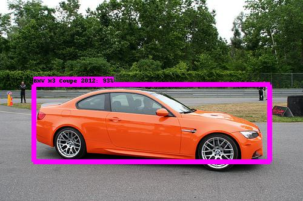

# TensorFlow Object Detection API for Stanford Cars

Use Google's TensorFlow Object Detection API [0] to detect 196 vehicles types in the Stanford Cars dataset [1]. 

## Dependencies

This project is heavily dependent on the TensorFlow Object Detection API and all of it's requirements. Mainly:

* Python 2.7
* Python VirtualEnv and VirtualEnvWrapper
* Protobuf 3.0.0
* Tensorflow (>=1.9.0)

For a complete list, see [0].

## Getting Started

### Download the vehicle images 

Download the Stanford Cars dataset.

```
http://imagenet.stanford.edu/internal/car196/car_ims.tgz
```

Unzip the tgz file into your data folder. 
```
tar -xzvf car_ims.tgz -C <data folder>
```

### Cloning the repository

```
$ git clone https://github.com/deanwetherby/tf_oda_stanford_cars
```

### Make a virtual environment with required packages

I highly recommend using a Python 2 virtual environment called 'tf' which is short for TensorFlow. If you need help setting up a virtual environment, I suggest you visit Adrian Rosebrock's website called pyimagesearch.com[2].

The steps are essentially:
```
$ mkvirtualenv tf -p python2
(tf) $ cd <workspace>/tf_oda_stanford_cars
(tf) $ pip install -r requirements.txt
```

### Create tfrecords and labels file

Create the train and test tfrecords from the Stanford Cars annotations. Their train/test split is about 50/50 which is slightly irregular these days. In the future, I'd like to change the scripts to use more of an 80/10/10 split instead but it's fine for now. You can create the label map using the script or use the labels file already provided for you in this git repository. This label creation script is very specific to the matlab format that Stanford Cars uses. 

```
(tf) $ python create_stanford_cars_tf_record.py --data_dir=<data folder> --set=train --output_path=stanford_cars_train.tfrecord
(tf) $ python create_stanford_cars_tf_record.py --data_dir=<data folder> --set=test --output_path=stanford_cars_test.tfrecord
(tf) $ python create_stanford_cars_label_map.py <data folder>/cars_annos.mat
```

(Optional) Test the creation of the train and test tfrecords by dumping their data to a temporary folder to ensure the tfreocrds have been written correctly.

```
(tf) $ python dump.py --input_file stanford_cars_train.tfrecord --output_path ./train 
(tf) $ python dump.py --input_file stanford_cars_test.tfrecord --output_path ./test 
```

### Download pretrained model

Download a pretrained model from the model zoo [3] and untar to your models folder. I used SSD MobileNet v2 for this project.

### Modify the pipeline configuration file

Change the number of classes in the pipeline.config associated with your model to 196 to match the number of classes in Stanford Cars. Also update the paths to your fine tune checkpoint and labels file for both train and eval. You will have to remove any references to "batch_norm_trainable: true" from the config file. This feature has been deprecated and will prevent success training.

## Training the vehicle model

```
(tf) $ python ~/workspace/models/research/object_detection/model_main.py --pipeline_config_path=./models/ssd_mobilenet_v2_coco_2018_03_29/pipeline.config --model_dir=output --num_train_steps=100000 --num_eval_steps=1000
```

```
(tf) $ PYTHONPATH=/home/edge/git/models-fresh/research/:/home/edge/git/models-fresh/research/slim python ~/git/models-fresh/research/object_detection/model_main.py --pipeline_config_path=./models/ssd_mobilenet_v2_coco_2018_03_29/pipeline.config --model_dir=output --num_train_steps=100000 --num_eval_steps=1000
```

## Evaluation

There's no eval.py script in the new version of the Object Detection API. So we will convert the checkpoint to a pb file and run prediction on a few example images just to get a visual indication of how well it is doing.

### Convert the checkpoint to frozen graph (.pb file)

```
(tf) $ python -u ~/workspace/models/research/object_detection/export_inference_graph.py --input_type=image_tensor --pipeline_config_path=./models/ssd_mobilenet_v2_coco_2018_03_29/pipeline.config --trained_checkpoint_prefix=output/model.ckpt-100000 --output_directory=./stanford_cars_inference_graph/
```

### Prediction on an example image

```
(tf) $ python predict_image.py --model stanford_cars_inference_graph/frozen_inference_graph.pb --labels stanford_cars_labels_map.pbtxt --image image0.jpg 
```

Here are a few example vehicles images taken from the Cars dataset with detection boxes.




## References

```
[0] TensorFlow Object Detection API, https://github.com/tensorflow/models/tree/master/research/object_detection
[1] Stanford Cars, https://ai.stanford.edu/~jkrause/cars/car_dataset.html
[2] PyImageSearch Virtual Environments, https://www.pyimagesearch.com/2017/09/27/setting-up-ubuntu-16-04-cuda-gpu-for-deep-learning-with-python/
[3] Model Zoo, https://github.com/tensorflow/models/blob/master/research/object_detection/g3doc/detection_model_zoo.md
```

