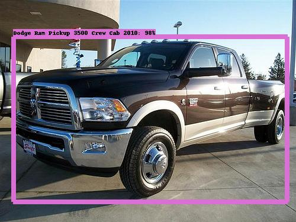
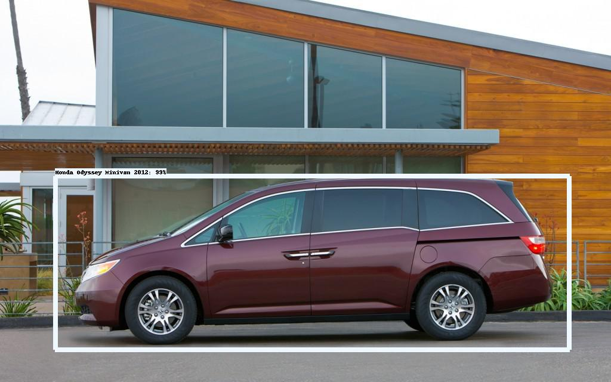

# TensorFlow Object Detection API for Stanford Cars

Use Google's TensorFlow Object Detection API [0] to detect 196 vehicles types in the Stanford Cars dataset [1]. 

## Dependencies

This project is heavily dependent on the TensorFlow Object Detection API and all of it's requirements. Mainly:

* Python 2.7
* Python VirtualEnv and VirtualEnvWrapper
* Protobuf 3.0.0
* Nvidia Cuda drivers
* Tensorflow (>=1.9.0)
* TensorFlow models and examples repository

For a complete list, see [0].

## Getting Started

### Download the vehicle images 

Download the Stanford Cars dataset (images and Matlab labels).

```
$ wget http://imagenet.stanford.edu/internal/car196/car_ims.tgz
$ wget http://imagenet.stanford.edu/internal/car196/cars_annos.mat 
```

Unzip the tgz file into your data folder. 
```
$ tar -xzvf car_ims.tgz -C <data folder>
```

The labels file (cars_annos.mat) needs to be in the same folder as the extracted images.

	.
	|--- ...
	|--- <Stanford cars data folder>
	|    |--- cars_annos.mat
	|    |--- car_ims
	|         |--- <images>
	|--- ...

### Cloning this repository

```
$ git clone https://github.com/deanwetherby/tf_oda_stanford_cars
$ cd tf_oda_stanford_cars
```

### Make a virtual environment with required packages

I highly recommend using a Python 2 virtual environment. If you need help setting up a virtual environment, I suggest you visit Adrian Rosebrock's website called pyimagesearch.com[2]. I made a TensorFlow environment (tf).

The steps are essentially:
```
$ mkvirtualenv tf -p python2
(tf) $ pip install -r requirements.txt
```

Be sure to also clone the TensorFlow models github repository to some other folder directory. We will refer to this location as the <TensorFlow models folder> which should be different than the local 'models' folder.

```
$ git clone https://github.com/tensorflow/models 
```

For the rest of this code, you need to either export the PYTHONPATH to point to the research and slim folders or you can provide the PYTHONPATH at the command line without having to export the variable.

```
$ export PYTHONPATH=<TensorFlow models folder>/research:<TensorFlow models folder>/research/slim
```

### Create tfrecords and labels file

Create the train and test tfrecords from the Stanford Cars annotations. Their train/test split is about 50/50 which is slightly irregular these days. In the future, I'd like to change the scripts to use more of an 80/10/10 split instead but it's fine for now. You can create the label map using the script or use the labels file already provided for you in this git repository. 

```
(tf) $ python create_stanford_cars_label_map.py <data folder>/cars_annos.mat
(tf) $ python convert_mat_to_csv.py <data folder>/cars_annos.mat stanford_cars_labels.csv
(tf) $ python create_stanford_cars_tf_record.py --data_dir=<data folder> --set=train --output_path=stanford_cars_train.tfrecord --csv=stanford_cars_labels.csv
(tf) $ python create_stanford_cars_tf_record.py --data_dir=<data folder> --set=test --output_path=stanford_cars_test.tfrecord --csv=stanford_cars_labels.csv
```

(Optional) Test the creation of the train and test tfrecords by dumping their data to a temporary folder to ensure the tfreocrds have been written correctly.

```
(tf) $ python dump.py --input_file stanford_cars_train.tfrecord --output_path ./train 
(tf) $ python dump.py --input_file stanford_cars_test.tfrecord --output_path ./test 
```

## Training the vehicle model

### Download pretrained model

Download a pretrained model from the model zoo [3] and untar to your tf_oda_stanford_cars/models folder. I used SSD MobileNet v2 for this project.

```
(tf) $ tar -xvf ssd_mobilenet_v2_coco_2018_03_29.tar.gz
```

### Modify the pipeline configuration file

Change the number of classes in the pipeline.config associated with your model to 196 to match the number of classes in Stanford Cars. Also update the paths to your fine tune checkpoint and labels file for both train and eval. 

:exclamation: You will have to remove any references to "batch_norm_trainable: true" from the pipeline.config file. This feature has been deprecated and will prevent successful training.

:grey_question: Depending on your GPU memory size, you may have to reduce the train_config.batch_size. A batch size of 24 works on an 8GB GTX 1080.

Items to modify in the pipeline.config:
* model.ssd.num_classes
* train_config.fine_tune_checkpoint
* train_input_reader.label_map_path
* train_input_reader.tf_record_input_reader
* eval_input_reader.label_map_path
* eval_input_reader.tf_record_input_reader


### Train the model

Use TensorFlow's model_main.py to train the model. This is TensorFlow's "easy" button for training deep learning models. Be sure to replace the model folder with your path.

This command uses the command line PYTHONPATH as opposed to exporting the variable. If you already exported the PYTHONPATH, you can ignore that portion.

```
(tf) $ python <TensorFlow models folder>/research/object_detection/model_main.py --pipeline_config_path=./models/ssd_mobilenet_v2_coco_2018_03_29/pipeline.config --model_dir=output --num_train_steps=100000 --num_eval_steps=100
```

### Convert the checkpoint to frozen graph (.pb file)

```
(tf) $ python -u <TensorFlow models folder>/research/object_detection/export_inference_graph.py --input_type=image_tensor --pipeline_config_path=./models/ssd_mobilenet_v2_coco_2018_03_29/pipeline.config --trained_checkpoint_prefix=output/model.ckpt-100000 --output_directory=./stanford_cars_inference_graph/
```

## Evaluation

There's no eval.py script in the new version of the Object Detection API. So we will convert the checkpoint to a pb file and run prediction on a few example images just to get a visual indication of how well it is doing.

### Prediction on an example image


```
(tf) $ python predict_image.py --model stanford_cars_inference_graph/frozen_inference_graph.pb --labels stanford_cars_labels_map.pbtxt --image image0.jpg 
```

Here are a few example vehicles images taken from the Cars dataset with detection boxes.






## References

```
[0] TensorFlow Object Detection API, https://github.com/tensorflow/models/tree/master/research/object_detection
[1] Stanford Cars, https://ai.stanford.edu/~jkrause/cars/car_dataset.html
[2] PyImageSearch Virtual Environments, https://www.pyimagesearch.com/2017/09/27/setting-up-ubuntu-16-04-cuda-gpu-for-deep-learning-with-python/
[3] Model Zoo, https://github.com/tensorflow/models/blob/master/research/object_detection/g3doc/detection_model_zoo.md
```

